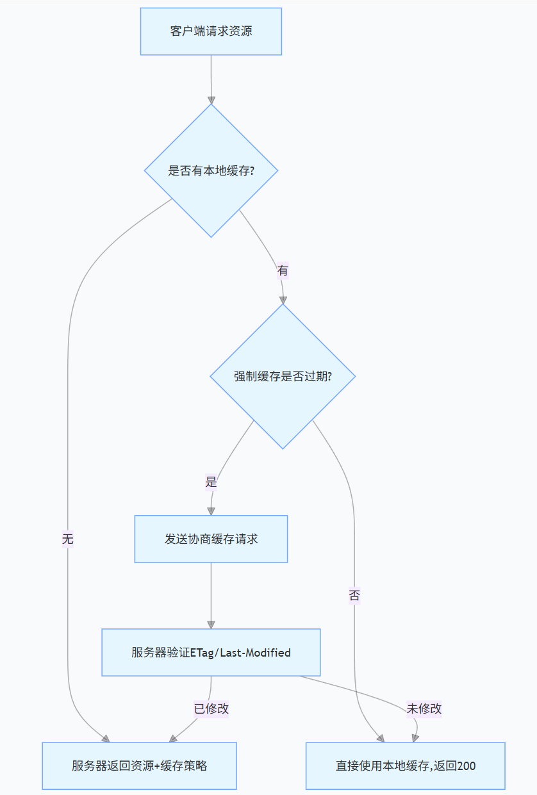

## HTTP 缓存

### 一、HTTP 缓存的核心概念

HTTP 缓存是一种通过临时存储资源副本，减少客户端与服务器重复数据传输的优化机制。其本质是利用 HTTP 协议头部字段控制资源的缓存策略，核心目标是**减少网络请求次数**和**降低服务器负载**。

### 二、HTTP 缓存的分类与工作原理

#### 1. 强制缓存（本地缓存）

- **核心机制**：客户端首次请求后，服务器告知资源的缓存有效期，后续请求直接从本地读取。

- **关键字段**：`Cache-Control`（HTTP/1.1）：

  - `max-age=秒数`：资源在本地缓存的最大时间（如 `max-age=3600` 表示 1 小时）。
  - `public`：资源可被客户端和代理服务器缓存。
  - `private`：资源仅客户端可缓存（如用户隐私数据）。
  - `no-cache`：需先验证缓存有效性，再决定是否使用。
  - `no-store`：禁止任何形式的缓存（实时数据场景）。

  - `Expires`（HTTP/1.0）：资源过期的绝对时间（如 `Expires: Thu, 10 Jun 2025 12:00:00 GMT`），优先级低于 `Cache-Control`。

- **流程示例**：

  ```plaintext
  首次请求：客户端 → 服务器（返回资源 + Cache-Control: max-age=3600）
  后续请求：客户端直接读取本地缓存（1小时内不发请求）
  ```

#### 2. 协商缓存（对比缓存）

- **核心机制**：客户端发送请求时携带缓存标识，服务器判断是否使用旧资源。

- **关键字段**：

  - 两种验证方式：

    | 类型         | 字段名          | 服务器判断逻辑                                               |
    | ------------ | --------------- | ------------------------------------------------------------ |
    | 内容哈希     | `ETag`          | 资源内容变化时生成新哈希（如 `ETag: "abc123"`）              |
    | 最后修改时间 | `Last-Modified` | 资源最后修改时间（如 `Last-Modified: Thu, 10 Jun 2025 10:00:00 GMT`） |

  - 客户端请求携带字段：

    - `If-None-Match`：对应服务器返回的 `ETag`，用于验证资源是否更新。
    - `If-Modified-Since`：对应服务器返回的 `Last-Modified`，用于验证资源是否修改。

- **流程示例**：

  ```plaintext
  首次请求：服务器返回资源 + ETag: "abc123" + Last-Modified: ...
  后续请求：客户端携带 If-None-Match: "abc123"
  服务器判断：若哈希一致 → 返回 304 Not Modified（客户端用缓存）；否则返回新资源
  ```

### 三、HTTP 缓存状态码与流程

#### 1. 关键状态码

- <strong>`200 OK`<strong/>：服务器正常返回资源（首次请求或缓存失效）。
- <strong>`304 Not Modified`<strong/>：服务器告知客户端可使用本地缓存（协商缓存生效）。
- <strong>`403 Forbidden`<strong/>：缓存策略禁止访问（如 `no-store`）。

#### 2. 缓存流程示意图



### 四、缓存策略应用场景

#### 1. 适合强缓存的资源

- 静态资源：图片、CSS、JS（可设置 `max-age=31536000`，即 1 年）。
- 不常更新的资源：如网站 logo、公共组件。

#### 2. 适合协商缓存的资源

- 动态内容：如新闻列表（需定期验证是否更新）。
- 用户个性化数据：如购物车信息（需每次验证权限）。

#### 3. 禁止缓存的场景

- 敏感数据：如用户密码、支付信息（设置 `Cache-Control: no-store`）。
- 实时数据：如股票行情、直播流（设置 `Cache-Control: no-cache`）。

### 五、缓存优化实践

#### 1. 配置工具示例（Nginx）

```nginx
# 静态资源强缓存（1年）
location ~* \.(js|css|png|jpg|jpeg|gif|ico)$ {
    expires 1y;
    add_header Cache-Control "public";
}

# 协商缓存配置
location /api {
    # 启用ETag
    etag on;
    # 禁用强缓存，每次请求验证
    add_header Cache-Control "no-cache";
}
```

#### 2. 前端缓存策略

- **版本控制**：给静态资源 URL 添加版本号（如 `main.js?v=1.0.0`），强制更新缓存。
- **Service Worker**：结合 PWA 实现更灵活的客户端缓存（如离线页面）。

### 六、常见问题与解决方案

1. **缓存失效问题**
   - 现象：修改资源后客户端仍显示旧内容。
   - 方案：
     - 给资源 URL 添加时间戳（如 `main.js?timestamp=20250609`）。
     - 配置协商缓存（`ETag`），确保服务器验证更新。
2. **代理缓存污染**
   - 现象：不同用户访问同一 URL 看到他人数据。
   - 方案：设置 `Cache-Control: private`，禁止代理服务器缓存。
3. **缓存策略冲突**
   - 规则：HTTP/1.1 字段（`Cache-Control`）优先级高于 HTTP/1.0（`Expires`）。

### 七、HTTP/2 与 HTTP/3 对缓存的优化

- **HTTP/2**
  - 多路复用减少请求延迟，缓存策略基本与 HTTP/1.1 一致。
  - 头部压缩（HPACK）减少缓存控制字段的传输体积。
- **HTTP/3（基于 QUIC）**：
  - 连接迁移特性确保缓存策略在网络切换时持续生效。
  - 更高效的流控制，提升缓存资源的加载速度。

通过合理配置 HTTP 缓存，可显著提升网站性能（减少带宽消耗 30%~80%），同时降低服务器压力。实际应用中需根据资源类型和更新频率灵活调整策略，平衡用户体验与数据实时性。